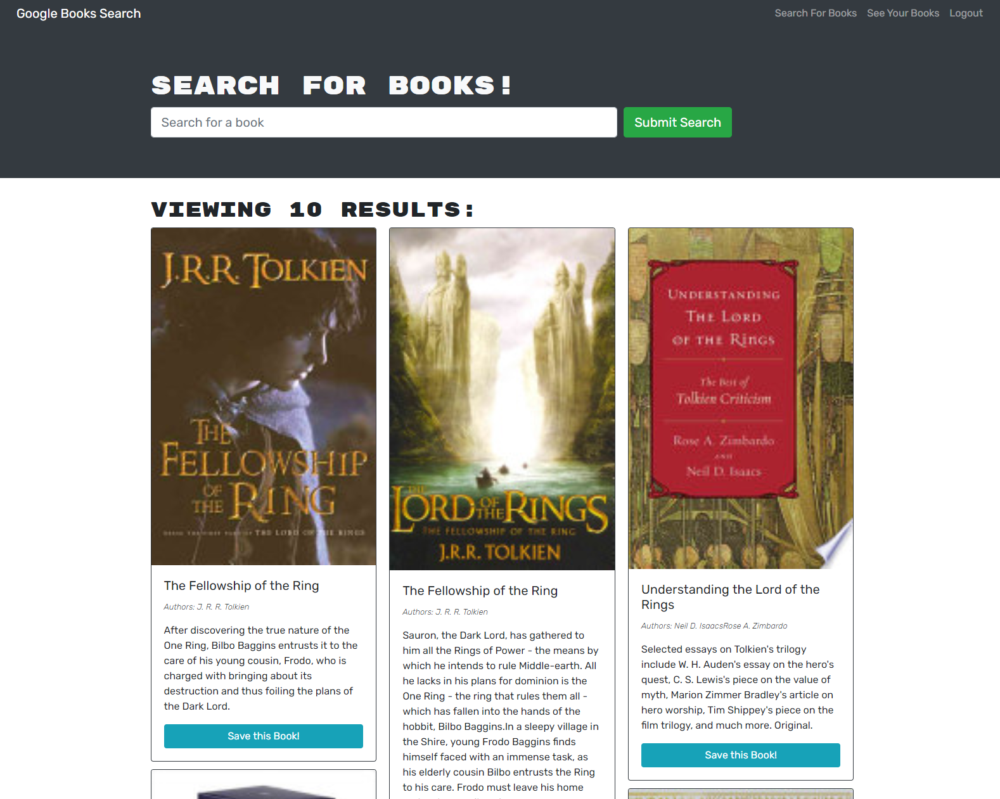

# Google Books Search Engine

## Description
This is a MERN app that utilizes GraphQL using Apollo client and server. Search for any book in the world with the Google Books API. Users can create an account and save books to their personal and persistant list. They can also delete the books from their saved list if desired. Thanks for checking out the app and have fun reading!

## Table of Contents

* [Installation](#Installation)
* [Usage](#Usage)
* [License](#License)
* [Questions](#Questions)
* [Credits](#Credits)

## Installation
No installation required. Head to the Google Books Search Engine by clicking [here](https://google-book-search-engine-app.herokuapp.com/)!

## Usage
Navigate to the homepage. Search books or login/signup. Once logged in you can save books to your favourites list! Here is a screenshot of the website:   

## License
MIT License

## Questions
You may contact the project author via:
* Email: seanbrent5@live.ca
* GitHub: [Brentsa](https://github.com/Brentsa)

## Credits
Sean Brent